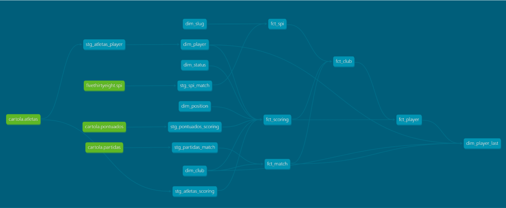

# :soccer: Palpiteiro
Fantasy soccer tips with machine learning and genetic algorithm.

## Architecture Overview

 

### Data Warehouse
The data warehouse is Google Cloud Big Query and it is built with DBT

The model *dim_player_last* is the main one. It has all features (player, club and opponent performance) for the players available for the next round. It has a remote function (which is a Google Cloud Function) that receives these features and uses a **histogram-based gradient boosting regression tree** (sklearn version from LightGBM) to predict how many points each player will score in the next round.

You can interact with this lineage graph in the [DBT Docs](https://matheusccouto.github.io/palpiteiro).

### Backend
Gets available players (already with points predictions) for the next matches from Google Big Query and drafts the line up using a **genetic algorithm written in pure python** and returns.

### ETLs
ETLs are AWS step functions that reads the API, saves raw data in a S3 bucket and loads into GCP Big Query.

#### Cartola Players
Players data from Cartola API comes in a nested JSON. It is stored as it is in S3, flatten into a CSV, which is also stored and finally loaded into google big query.

#### Cartola Scouts
Players scouts data from Cartola API comes in a nested JSON. It is stored as it is in S3, flatten into a CSV, which is also stored and finally loaded into google big query.

#### Cartola Matches
Matches data from Cartola API comes in a nested JSON. It is stored as it is in S3, flatten into a CSV, which is also stored and finally loaded into google big query.

#### FiveThirtyEight SPI
Soccer Power Index data from FiveThirtyEight API already comes in CSV, so it just need to be stored as it is in S3 and loaded into Google Big Query.

## Contact

