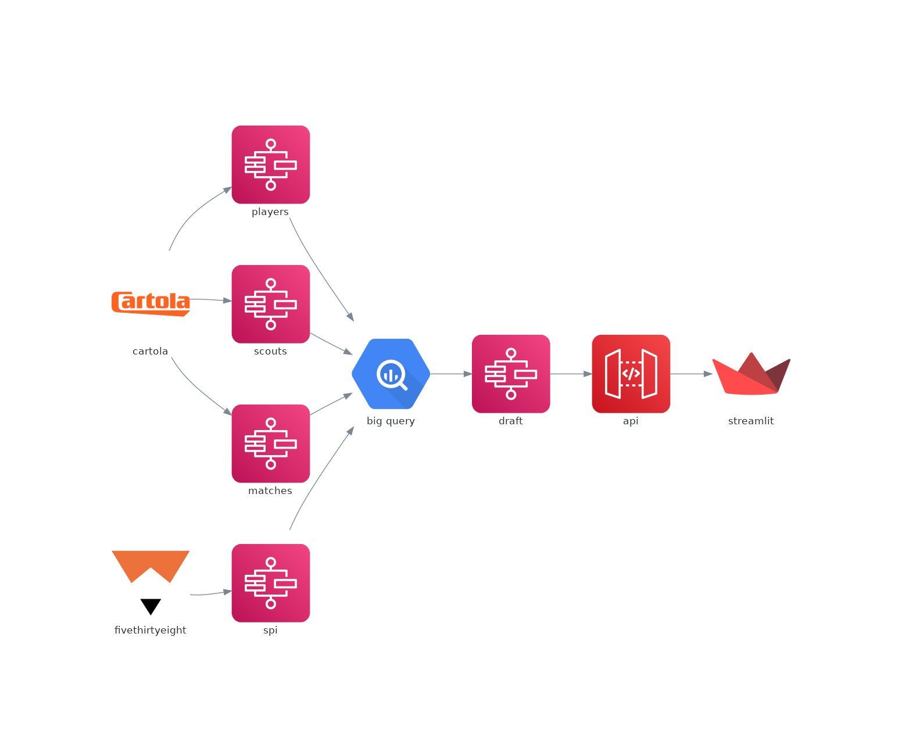
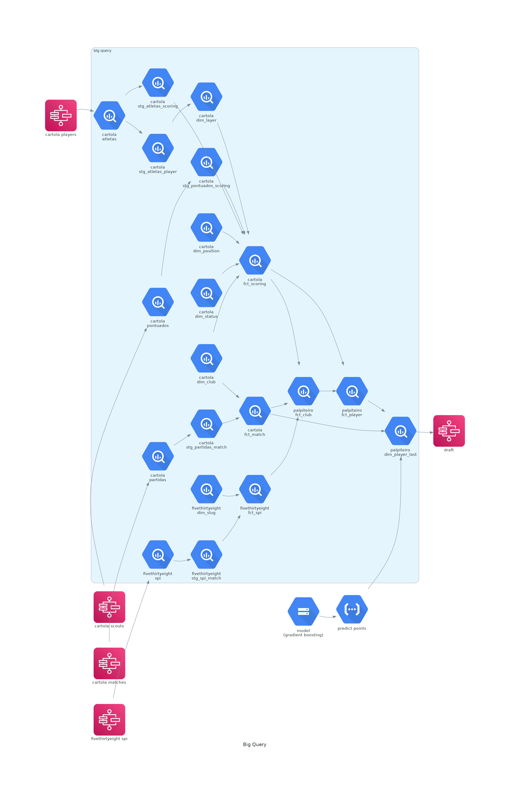
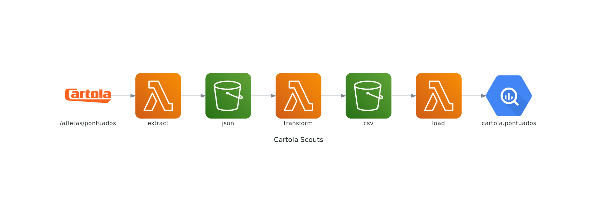
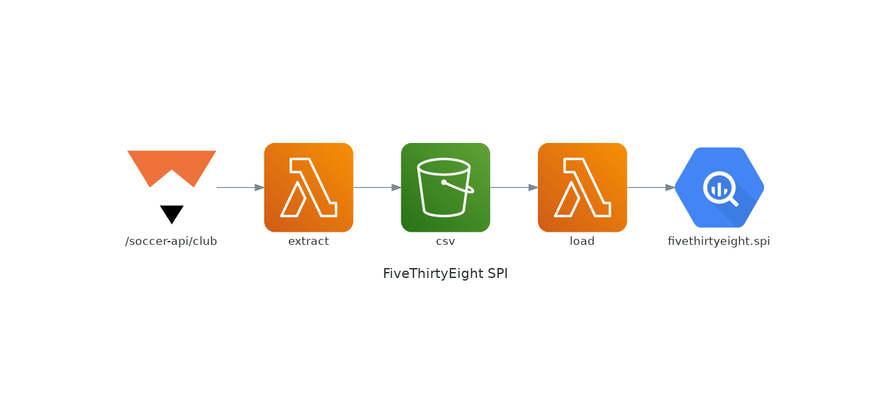
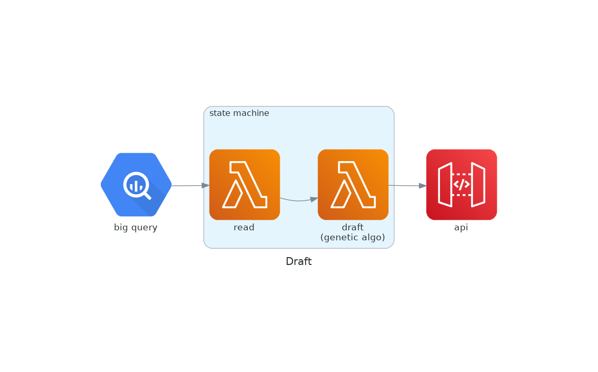

# Palpiteiro
| prod | dev |
| --- | --- |
|  | |
|  | |
|  | |
|  |
| 

## Overview

## Big Query

## Step Functions
### Cartola Players

### Cartola Scouts

### Cartola Matches

### FiveThirtyEight SPI

### Draft
